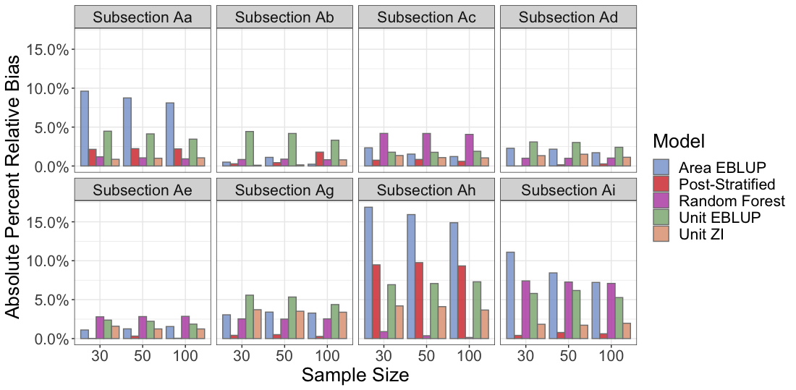
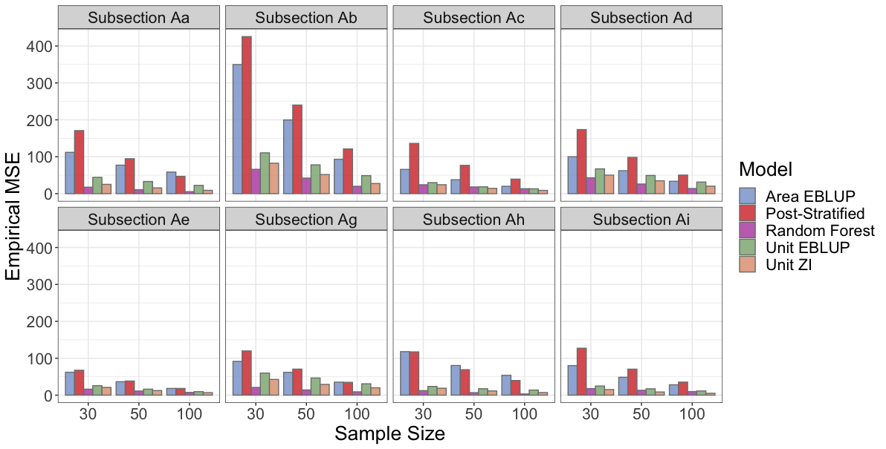

# RF-Forests

### Update Oct 20
#### New Findings
This past week I build, simulated on the cluster, and compared the simple random forest model to the other study models (PS, area and unit EBLUP, and zero inflation model), again using `tcc16` and `evi` as our predictors across the 2000 simulation samples. We find rather variable results when it comes to relative bias: for subsections Aa Ab Ad, Ag, and Ah, the random forest model performs as well or better than the zero inflation model, while subsections Ac, Ae, and Ai the random forest performs poorly. The EMSE results are surprising, with the random forest performing shockingly consistently low compared with all other study models. 
 

#### Directions for Future Work
The next project goal is implementing a mixed effects random forest model (MERF). The algorithm for fitting a MERF is iterative and similar to the expectation maximization algorithm where it alternates fitting a random forest with known fixed effects, to predicting the fixed effects using the random forest. I considered using `LongituRF` however I couldn't figure out how exactly to get this working for non-longitudinal data (perhaps I was missing something) but maybe the package is designed only for that? I then looked into another package `MixRF` which seems to have what we want - although there seems to be limited ability to tune this model. One issue I wanted to discuss with this package is that it doesn't seem to be well applied to the small area estimation problem because it calculates the fixed effects (over our subsections) on the predictions from the sample only. I think we should be fitting the fixed effects on the population data - otherwise we'd get sample bias? 

On the other hand, I am concerned about the computation problem if we end up coding our own MERF model as the iterative approach would mean we'll need to predict the 3 million pixels potentially 100 times (or whatever max_iter is set as). 

The other package option is to contact on of the authors of the paper that implements a similar MERF model to see if i can get their code. 